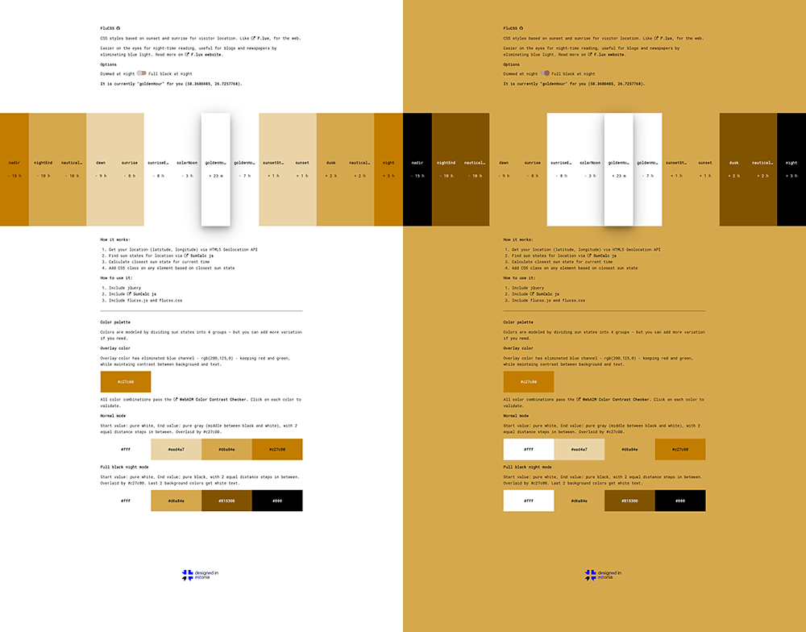

# [FluCSS by Veli](http://veli.ee/flucss/)
jQuery plugin for CSS styles based on sunset and sunrise for visitor location. Like [F.lux](http://justgetflux.com/), for the web.

## 😎 [Preview demo](http://veli.ee/flucss/)

Easier on the eyes for night-time reading, useful for blogs and newspapers by eliminating blue light. Read more on [F.lux website](http://justgetflux.com/).

Options: Dimmed at night, Full black at night 

  
🔆 How it works

  
## How it works:
1. Get your location (latitude, longitude) via HTML5 Geolocation API
2. Find sun states for location via SunCalc js
3. Calculate closest sun state for current time
4. Add CSS class on any element based on closest sun state
5. Use localStorage to prevent page flickering while navigating or reloading

  
🔅 How to use it

  
## How to use it:
1. Include jQuery
2. Include [SunCalc js](https://github.com/mourner/suncalc)
3. Include flucss.min.js and flucss.css
4. call $("html").flucss(); // for any element you want, mostly you want "html" or "body"
  

  
🌓 Color palette

## Color palette
Colors are modeled by dividing sun states into 4 groups — but you can add more variation if you need.

### Overlay color
Overlay color has eliminated blue channel - rgb(200,125,0) - keeping red and green, while maintaing contrast between background and text.

All color combinations pass the [WebAIM Color Contrast Checker](http://webaim.org/resources/contrastchecker/). Click on each color to validate. 

### Normal mode
Start value: pure white, End value: pure gray (middle between black and white), with 2 equal distance steps in between. Overlaid by #c27c00.

### Full black night mode
Start value: pure white, End value: pure black, with 2 equal distance steps in between. Overlaid by #c27c00. Last 2 background colors get white text. 

  

